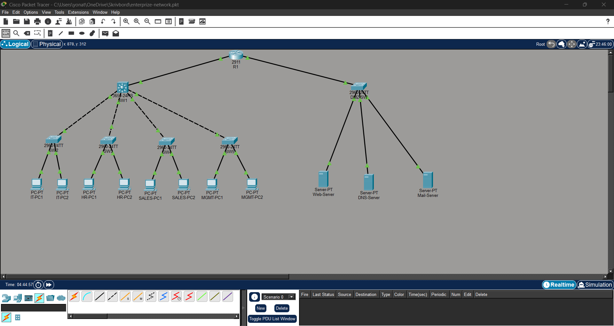

# Enterprise Network Lab — Cisco Packet Tracer

A small/medium business network built in Cisco Packet Tracer, demonstrating VLAN segmentation, inter-VLAN routing via a Layer 3 switch, and DHCP services. Built as part of ongoing CCNA study.

---

## Network Topology

                [ R1 ]
                  |
               [ SW1 ]  (L3 core — inter-VLAN routing via SVIs)
      /    /    |    \    \
   SW2   SW3   SW4   SW5  Server-SW
    |     |     |     |      |  |  |
   IT    HR   Sales  Mgmt  Web DNS Mail

   
---

## VLAN Design

| VLAN | Name       | Subnet           | Purpose                        |
|------|------------|------------------|---------------------------------|
| 10   | IT         | 10.10.10.0/24    | IT department clients (DHCP)   |
| 20   | HR         | 10.10.20.0/24    | HR department clients (DHCP)   |
| 30   | Sales      | 10.10.30.0/24    | Sales department clients (DHCP)|
| 40   | Management | 10.10.40.0/24    | Network admin clients (DHCP)   |
| 100  | Servers    | 10.10.100.0/24   | Internal servers (static)      |

---

## Device Inventory

| Device     | Model      | Role                                  |
|------------|------------|----------------------------------------|
| R1         | Cisco 2911 | Router — currently single uplink, no WAN edge configured |
| SW1        | Cisco 3650 | L3 core switch — SVIs, inter-VLAN routing, DHCP server |
| SW2        | Cisco 2960 | Access switch — IT                    |
| SW3        | Cisco 2960 | Access switch — HR                    |
| SW4        | Cisco 2960 | Access switch — Sales                 |
| SW5        | Cisco 2960 | Access switch — Management            |
| Server-SW  | Cisco 2960 | Access switch — internal servers      |

---

## Design Decisions

**Collapsed core, L3 switch as routing point**
SW1 (3650, multilayer) performs inter-VLAN routing directly via SVIs — each VLAN's gateway lives on SW1, not on R1. R1's uplink to SW1 is a routed point-to-point link, not a trunk; R1 does not need to be VLAN-aware. This mirrors a standard small/medium business pattern where the router is reserved for the network edge and the L3 switch handles all internal routing.

**Servers on their own VLAN, not per-department**
Web, DNS, and Mail servers sit in VLAN100, statically addressed, rather than joining any single department's VLAN. This reflects that they're shared resources accessed across all departments, and keeps them addressable independently of user VLAN growth or changes.

**DHCP handled by SW1 directly**
Rather than a separate dedicated DHCP server, SW1 runs DHCP pools for VLAN10/20/30/40 itself, since it already owns every SVI as each VLAN's gateway. Servers (VLAN100) and infrastructure devices use static addressing.

**No authentication currently configured**
Console, VTY, and enable passwords have been intentionally removed on all devices for this lab so the file is immediately accessible to anyone reviewing it. This is a deliberate lab-accessibility choice, not a real-world security posture.

---

## Verification (tested and confirmed)

| Test | Result |
|------|--------|
| DHCP lease — all 4 user VLANs | Confirmed via `show ip dhcp binding` on SW1 |
| Inter-VLAN ping (IT → HR) | Success |
| Server-SW → internal servers | Success |
| SW1 inter-VLAN routing via SVI | Confirmed via `show ip interface brief` |

---

## Not Yet Implemented

- WAN/internet edge on R1 (currently a single internal link only)
- Redundancy — single router, single switch uplinks throughout (no HSRP/VRRP, no redundant trunks)
- Firewall or ACL-based traffic control between segments
- Dynamic routing protocol (currently static/directly-connected only)
- Port security on access ports

---

## Skills Demonstrated

- VLAN configuration and 802.1Q trunking
- Layer 3 switching and SVI-based inter-VLAN routing
- DHCP pool configuration and troubleshooting
- Cisco IOS password recovery (ROMMON, configuration register)
- Cisco IOS CLI
